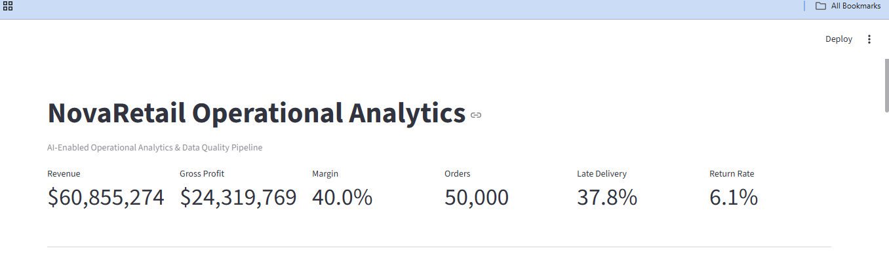

# AI-Enabled Operational Analytics & Data Quality Pipeline

An end-to-end operational analytics project that transforms raw business data into validated analytical datasets, detects operational risks, and presents actionable insights through an interactive dashboard.

The project demonstrates practical experience with **Python, SQL, ETL, data modeling, data quality validation, automated testing, anomaly detection, business analytics, and visualization**.

---

## Business Problem

NovaRetail is a fictional U.S. e-commerce and distribution company processing thousands of customer orders across multiple regions, warehouses, product categories, and shipping carriers.

Leadership needs better visibility into:

- Revenue and profitability
- Late deliveries
- Product returns
- Carrier performance
- Regional performance
- Data quality
- Operational risks

The objective of this project is to build an automated analytical workflow that converts raw operational data into reliable business insights and recommendations.

---

## Solution Architecture

```text
Synthetic Operational Data
        |
        v
Python Data Generation
        |
        v
Raw CSV Files
        |
        v
Data Quality Validation
        |
        v
Python ETL Pipeline
        |
        v
SQLite Database
        |
        v
SQL Analytical Views
        |
        v
KPI & Anomaly Analysis
        |
        v
Operational Recommendations
        |
        v
Streamlit Dashboard
```

The complete workflow can be executed through:

```bash
python run_project.py
```

---

## Tech Stack

| Area | Technology |
|---|---|
| Programming | Python |
| Querying | SQL |
| Database | SQLite |
| Data Processing | Pandas, NumPy |
| ETL | Python |
| Data Modeling | SQL analytical views |
| Visualization | Streamlit, Plotly |
| Data Quality | Python validation framework |
| Testing | Pytest |
| Version Control | Git / GitHub |

---

## Dataset

The project generates a reproducible synthetic operational dataset representing a retail/distribution business.

The current pipeline generates approximately:

| Dataset | Records |
|---|---:|
| Customers | 8,000 |
| Products | 120 |
| Warehouses | 4 |
| Orders | 50,000 |
| Order Items | ~100,000 |
| Shipments | 50,000 |
| Returns | ~6,000 |

A fixed random seed is used so results are reproducible.

The synthetic data also contains intentionally designed operational patterns, allowing the analytical workflow to discover meaningful business problems rather than simply visualize random data.

---

## Data Model

The operational model contains the following core entities:

```text
customers
    |
    +---- orders ---- order_items ---- products
             |
             +---- shipments ---- warehouses
             |
             +---- returns
```

### Core tables

- `customers` — customer and regional information
- `products` — product category, cost, and pricing information
- `orders` — transaction-level order information
- `order_items` — individual products within each order
- `shipments` — carrier, warehouse, and delivery information
- `returns` — product-return information
- `warehouses` — fulfillment locations

SQL views transform these normalized operational tables into analytics-ready datasets.

---

## SQL Analytics Layer

The project uses SQL to create reusable analytical views.

### `order_item_metrics`

Calculates:

- Revenue
- Product cost
- Gross profit
- Customer region
- Product category

### `shipment_metrics`

Calculates:

- Delivery duration
- Late-delivery indicator
- Carrier performance
- Regional fulfillment performance

### `return_metrics`

Combines:

- Return information
- Product categories
- Customer regions

These views separate analytical business logic from the visualization layer.

---

## Automated Data Quality Validation

Operational reporting is only useful when the underlying data is reliable.

The pipeline automatically validates:

- Duplicate order IDs
- Missing customer IDs
- Invalid quantities
- Invalid prices
- Broken product references
- Broken customer references
- Impossible shipment dates
- Negative shipping costs
- Negative refund amounts

Each validation produces:

```text
check_name
table
passed
issue_count
description
```

The results are written to:

```text
data/processed/data_quality_report.csv
```

---

## Automated Testing

Pytest is used to verify critical data-quality behavior.

Run:

```bash
pytest -q
```

Current result:

```text
2 passed
```

Tests include:

- Valid datasets passing all quality rules
- Invalid quantities being correctly detected

This provides a foundation for expanding automated regression testing as the pipeline grows.

---

## Operational Analytics

The analytical layer calculates KPIs including:

- Revenue
- Gross profit
- Profit margin
- Order volume
- Average order value
- Return rate
- Late-delivery rate
- Regional revenue
- Product-category performance
- Carrier performance
- Warehouse performance

---

## Anomaly Detection & Decision Support

The pipeline evaluates operational KPIs and identifies conditions requiring management attention.

Example output from the current dataset:

### Fulfillment Risk

**Midwest late-delivery rate: 42.25%**

Recommended action:

> Review carrier and warehouse performance in the region.

### Carrier Performance

**Carrier B late-delivery rate: 41.67%**

Recommended action:

> Perform a carrier SLA review and consider shifting priority shipment volume.

### Product Returns

**Electronics return rate: 12.99%**

Recommended action:

> Investigate product quality, product descriptions, packaging, and supplier defects.

These findings demonstrate how analytical results can be translated into operational recommendations rather than presented only as charts.

---

## AI-Enabled Extension

The current implementation uses deterministic analytical rules to translate detected KPI risks into plain-English operational recommendations.

This design intentionally separates:

```text
Data / Metrics
      |
      v
Risk Detection
      |
      v
Recommendation Layer
```

In a production environment, the recommendation layer could be extended with an LLM or agentic workflow to:

- Summarize anomalies
- Perform guided root-cause analysis
- Prioritize operational risks
- Generate management reports
- Trigger specialized analytical workflows
- Recommend follow-up actions

The current implementation therefore provides a reliable analytical foundation for future AI-enabled decision-support workflows without making business metrics dependent on generative AI.

---

## Interactive Dashboard

### Dashboard Preview



The Streamlit dashboard provides management visibility into:

- Monthly revenue trends
- Revenue by region
- Carrier late-delivery rates
- Product-category return rates
- Operational risk alerts
- Recommended actions
- Data-quality results

Run locally with:

```bash
streamlit run dashboard/app.py
```

---

## Project Structure

```text
ai_operational_analytics_project/
│
├── dashboard/
│   └── app.py
│
├── data/
│   ├── raw/
│   └── processed/
│
├── sql/
│   ├── schema.sql
│   └── analytics_views.sql
│
├── src/
│   ├── generate_data.py
│   ├── pipeline.py
│   ├── data_quality.py
│   └── anomaly_detection.py
│
├── tests/
│   └── test_data_quality.py
│
├── run_project.py
├── requirements.txt
├── pytest.ini
└── README.md
```

---

## Running the Project

### 1. Clone the repository

```bash
git clone <repository-url>
cd ai-operational-analytics-data-quality-pipeline
```

### 2. Create a virtual environment

Windows:

```bash
python -m venv venv
venv\Scripts\activate
```

Git Bash:

```bash
python -m venv venv
source venv/Scripts/activate
```

macOS/Linux:

```bash
python3 -m venv venv
source venv/bin/activate
```

### 3. Install dependencies

```bash
pip install -r requirements.txt
```

### 4. Execute the pipeline

```bash
python run_project.py
```

The pipeline will:

1. Generate synthetic operational data
2. Validate data quality
3. Build the SQLite database
4. Create SQL analytical views
5. Calculate operational metrics
6. Detect anomalies
7. Generate operational recommendations

### 5. Run automated tests

```bash
pytest -q
```

### 6. Launch the dashboard

```bash
streamlit run dashboard/app.py
```

---

## Key Business Questions

The project helps answer questions such as:

- Which regions have the highest fulfillment risk?
- Which carriers are contributing most to delivery delays?
- Which product categories have unusually high return rates?
- Where are profitability problems occurring?
- Are source-data issues affecting operational reporting?
- Which operational problems should management prioritize?
- What actions should the business investigate next?

---

## Skills Demonstrated

This project demonstrates practical experience with:

**SQL**
- Joins
- Aggregations
- Analytical transformations
- KPI calculations
- Reusable SQL views

**Python**
- Data generation
- ETL
- Validation
- Analytics
- Automation
- Modular application design

**Data Engineering**
- Relational data modeling
- ETL workflows
- Data-quality controls
- Analytics-ready transformations

**Testing**
- Automated data-quality tests
- Pytest
- Validation of business rules

**Business Analytics**
- KPI design
- Trend analysis
- Anomaly identification
- Root-cause investigation
- Operational recommendations

**Visualization**
- Interactive Streamlit dashboard
- Plotly visualizations
- Management-focused reporting

---

## Future Enhancements

Potential production-oriented extensions include:

- Apache Airflow pipeline orchestration
- PySpark for distributed transformations
- PostgreSQL or cloud data warehouse integration
- AWS deployment
- Automated pipeline monitoring
- Additional regression and integration tests
- Forecasting
- LLM-assisted root-cause summaries
- Agentic workflows for operational investigation

---

## Project Purpose

This project was created to demonstrate how analytics can support operational decision-making through a combination of **SQL, Python, data modeling, ETL, data quality, testing, automation, visualization, and decision-support workflows**.